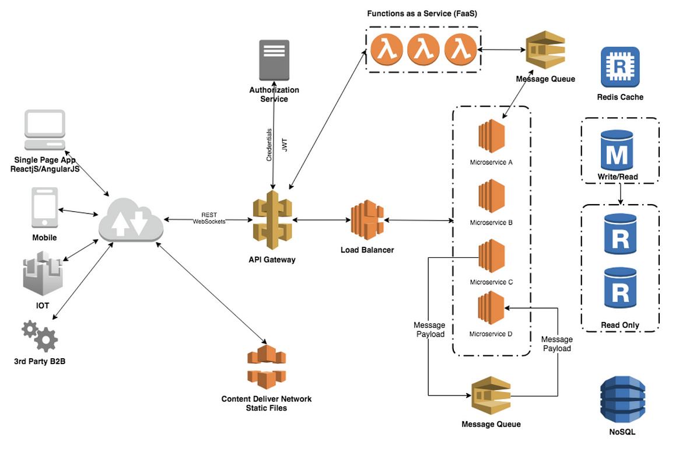

# Введение {.centered}

В данной работе рассматривается архитектура распределённых систем и методы повышения их надёжности. Актуальность темы обусловлена ростом требований к отказоустойчивости современных приложений.

Целью работы является анализ существующих подходов и разработка рекомендаций по проектированию надёжных систем.

# 1 Анализ предметной области

## 1.1 Обзор существующих решений

Современные распределённые системы строятся на основе нескольких ключевых принципов. Среди них выделяют горизонтальное масштабирование, репликацию данных и механизмы обнаружения сбоев.

Основные подходы к обеспечению надёжности:

- Репликация данных между узлами;
- Автоматическое переключение при сбое;
- Мониторинг состояния компонентов.

### 1.1.1 Сравнительный анализ архитектур

Рассмотрим три основные архитектуры распределённых систем и сравним их характеристики.

| Архитектура    | Надёжность | Сложность | Стоимость |
| -------------- | ---------- | --------- | --------- |
| Монолитная     | Низкая     | Низкая    | Низкая    |
| Микросервисная | Высокая    | Высокая   | Высокая   |
| Гибридная      | Средняя    | Средняя   | Средняя   |

: Таблица 1 - Сравнение архитектур распределённых систем

Как видно из таблицы, микросервисная архитектура обеспечивает наибольшую надёжность, однако требует значительных затрат на разработку и сопровождение.

## 1.2 Недостатки существующих подходов

Монолитная архитектура имеет существенный недостаток - единую точку отказа. При выходе из строя одного компонента вся система становится недоступной.

Микросервисная архитектура, в свою очередь, усложняет отладку и мониторинг. Трассировка запросов через множество сервисов требует специализированных инструментов.

# 2 Проектирование системы

## 2.1 Архитектура решения

Предлагаемое решение основано на гибридном подходе, сочетающем преимущества монолитной и микросервисной архитектур.

{width=80% fig-align="center"}

Система состоит из следующих компонентов:

1. Балансировщик нагрузки.
2. Кластер обработки запросов.
3. Распределённое хранилище данных.
4. Система мониторинга.

## 2.2 Механизм обеспечения надёжности

Надёжность системы обеспечивается на нескольких уровнях. На уровне инфраструктуры используется репликация узлов и автоматическое восстановление после сбоев.

На уровне приложения реализованы следующие механизмы:

- Повторные попытки при временных сбоях;
- Ограничение числа одновременных запросов;
- Изоляция неисправных компонентов.

### 2.2.1 Алгоритм обнаружения сбоев

Для обнаружения сбоев используется алгоритм **Phi Accrual Failure Detector**. Он вычисляет вероятность отказа узла на основе истории задержек heartbeat-сообщений.

Параметры алгоритма настраиваются в зависимости от характеристик сети:

| Параметр        | Значение по умолчанию | Описание                        |
| --------------- | --------------------- | ------------------------------- |
| threshold       | 8                     | Порог срабатывания              |
| max-sample-size | 200                   | Размер выборки задержек         |
| min-std-dev     | 100 мс                | Минимальное стандартное отклон. |

: Таблица 2 - Параметры алгоритма обнаружения сбоев

# Заключение {.centered}

В ходе работы был проведён анализ существующих архитектур распределённых систем. Выявлены основные недостатки монолитного и микросервисного подходов.

Предложена гибридная архитектура, обеспечивающая баланс между надёжностью и сложностью реализации. Описан механизм обнаружения сбоев на основе алгоритма *Phi Accrual Failure Detector*.

# Список литературы {.centered}

1. Фаулер М. Архитектура корпоративных программных приложений. - М.: Вильямс, 2020. - 544 с.
2. Клеппман М. Высоконагруженные приложения. - СПб.: Питер, 2018. - 640 с.
3. Ньюман С. Создание микросервисов. - СПб.: Питер, 2016. - 304 с.
4. Hayashibara N. The Phi Accrual Failure Detector // SRDS. - 2004. - С. 66-78.
5. Брюер Э. [Электронный ресурс]. - URL: https://example.com (дата обращения: 01.01.2024).
